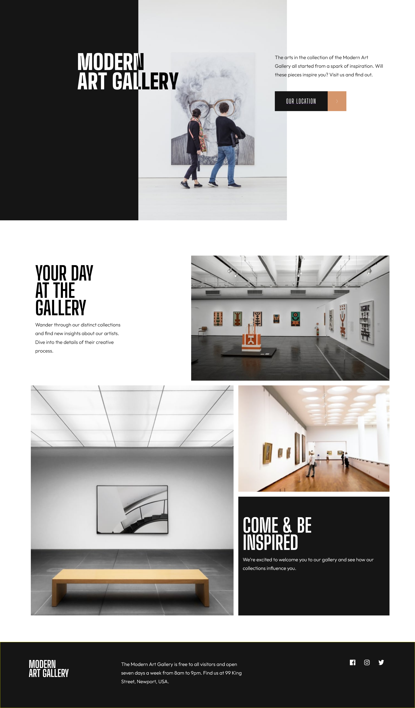

# Frontend Mentor - Art gallery website solution

This is a solution to the [Art gallery website challenge on Frontend Mentor](https://www.frontendmentor.io/challenges/art-gallery-website-yVdrZlxyA). Frontend Mentor challenges help you improve your coding skills by building realistic projects. 

## Table of contents

- [Overview](#overview)
  - [The challenge](#the-challenge)
  - [Screenshot](#screenshot)
  - [Links](#links)
- [My process](#my-process)
  - [Built with](#built-with)
  - [What I learned](#what-i-learned)
  - [Continued development](#continued-development)
- [Author](#author)

**Note: Delete this note and update the table of contents based on what sections you keep.**

## Overview

### The challenge

Users should be able to:

- View the optimal layout for each page depending on their device's screen size
- See hover states for all interactive elements throughout the site
- **Bonus**: Use [Leaflet JS](https://leafletjs.com/) to create an interactive location map with custom location pin

### Screenshot

### Links

- Live Site URL: (hszilvi.github.io/art-gallery-website/)

## My process

### Built with

- Semantic HTML5 markup
- CSS custom properties, SASS
- Flexbox
- CSS Grid
- Mobile-first workflow

### What I learned

This project was a good exercise to practise HTML and SASS, create responsive website. 
To see how you can add code snippets, see below:

### Continued development

Need to learn how to make responsive design transition smooth. 

## Author

- Frontend Mentor - [@hszilvi](https://www.frontendmentor.io/profile/hszilvi)

